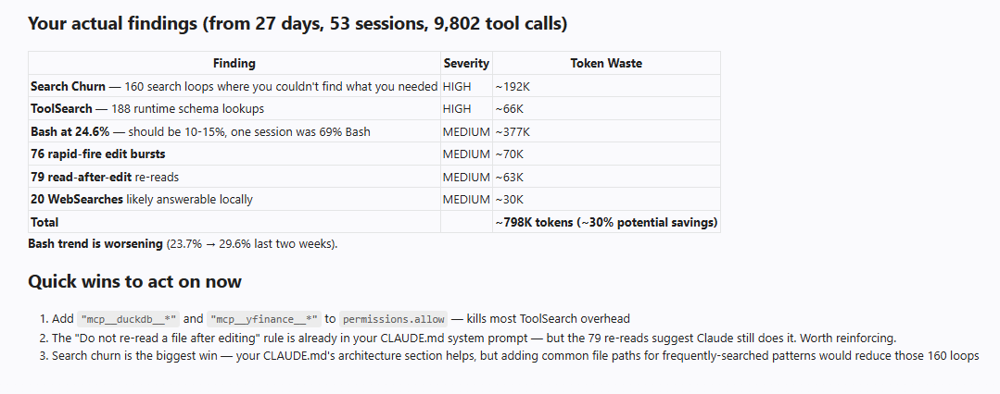

# cc-efficiency

Detects wasteful patterns in your Claude Code usage, estimates token overhead, and gives actionable recommendations to save tokens and move faster.

Zero dependencies -- Python 3.8+ stdlib only.



## What it does

- **21 anti-pattern detectors** across tool usage, session behavior, prompts, model selection, cache efficiency, and context overhead
- **Token waste estimates** with conservative per-call heuristics and dollar approximations
- **Weekly trends** to track if you're improving
- **Context audit** of MCP servers, skills, and plugins loaded but never used
- **Deep mode** that parses transcripts for compaction amnesia, subagent overkill, and round-trip waste
- **Educational output** that explains *why* each pattern costs money (prompt caching, model pricing, context overhead)

## What it doesn't do

It never reads your source code or conversation content. By default it only analyzes tool call metadata (which tool, when, which session). The `--deep` flag parses transcript structure but not message content. All data stays local.

## Quick Start

### 1. Install the hook (one-time)

Add this to `~/.claude/settings.json`. The enriched hook captures tool names, file paths, and search patterns for per-file analysis:

```jsonc
{
  "hooks": {
    "PostToolUse": [
      {
        "matcher": "*",
        "hooks": [
          {
            "type": "command",
            "command": "node -e \"process.stdin.resume();let d='';process.stdin.on('data',c=>d+=c);process.stdin.on('end',()=>{try{const e=JSON.parse(d);const i=e.tool_input||{};const meta={};if(i.file_path)meta.file=i.file_path;if(i.pattern)meta.pattern=i.pattern;if(i.command)meta.cmd=String(i.command).slice(0,120);if(i.prompt)meta.prompt=String(i.prompt).slice(0,80);if(i.query)meta.query=String(i.query).slice(0,80);if(i.description)meta.desc=String(i.description).slice(0,80);const line=JSON.stringify({type:e.hook_event_name,tool:e.tool_name,sessionId:e.session_id,timestamp:Date.now(),...meta})+'\\n';require('fs').appendFileSync(require('path').join(require('os').homedir(),'.claude','.dashboard-events.jsonl'),line)}catch(err){}})\""
          }
        ]
      }
    ],
    "Stop": [
      {
        "hooks": [
          {
            "type": "command",
            "command": "node -e \"process.stdin.resume();let d='';process.stdin.on('data',c=>d+=c);process.stdin.on('end',()=>{try{const e=JSON.parse(d);const line=JSON.stringify({type:e.hook_event_name,tool:e.tool_name,sessionId:e.session_id,timestamp:Date.now()})+'\\n';require('fs').appendFileSync(require('path').join(require('os').homedir(),'.claude','.dashboard-events.jsonl'),line)}catch(err){}})\""
          }
        ]
      }
    ]
  }
}
```

> See [`hooks.json`](hooks.json) for the full config including optional enhanced hooks for error tracking, permission denials, and session tracking.

### 2. Run the analyzer

```bash
# Full analysis (all time + deep + context audit) -- recommended
python cc_efficiency.py -A

# Last 7 days (default)
python cc_efficiency.py

# Last 30 days
python cc_efficiency.py --days 30

# All time, basic detectors
python cc_efficiency.py --all-time

# Dollar estimates for a different model
python cc_efficiency.py -A --model sonnet

# Machine-readable JSON
python cc_efficiency.py -A --json
```

### 3. Read the report

```
================================================================
  CLAUDE CODE EFFICIENCY REPORT
================================================================
  Period:      All time
  Sessions:    55
  Tool calls:  10,403
  Model:       Opus 4.6 ($5.0/MTok in, $25.0/MTok out)
================================================================

  NOTE: Dollar estimates are approximations based on input
  token pricing for Opus 4.6. Actual costs depend on
  your input/output mix, cache hits, and plan. The real
  currency is tokens -- dollars are for reference only.

FINDINGS
----------------------------------------------------------------

  1. [!!] Search Churn (Floundering)  (HIGH)
     ~~~~~~~~~~~~~~~~~~~~~~~~~~~~~~~~~~~~~~~~~~~~~~~~~~
     Churn loops: 168  |  Wasted calls: 1,740
     Est. token waste: ~201,600 (~$1.01)

  2. [! ] Prompt Cache Efficiency  (MEDIUM)
     ~~~~~~~~~~~~~~~~~~~~~~~~~~~~~~~~~~~~~~~~~~~~~~~~~~
     UNDER-USE:
       Estimated cache hit rate: 97.1%
       Cache expiries (>5min gaps): 296
     OVER-USE:
       Cached bloat (unused context): ~3,033 tokens/msg
     Est. token waste: ~1,816,762 (~$9.08)

  3. [! ] Bash Overuse  (MEDIUM)
     ~~~~~~~~~~~~~~~~~~~~~~~~~~~~~~~~~~~~~~~~~~~~~~~~~~
     Bash calls: 2,589 / 10,403 (24.9%)
     Est. token waste: ~411,600 (~$2.06)

  + 12 low-severity patterns (no action needed)

----------------------------------------------------------------
  TOTAL ESTIMATED TOKEN WASTE:     ~2,924,917 (~$14.62)
  PER SESSION AVERAGE:             ~53,180 (~$0.27)
----------------------------------------------------------------
```

## What It Detects (21 Patterns)

### Core Patterns (always run)

| # | Pattern | Signal | Token Cost | Fix |
|---|---------|--------|------------|-----|
| 1 | **Bash Overuse** | Bash >20% of tool calls | ~400/call | Use Grep/Read/Glob instead |
| 2 | **Search Churn** | 4+ Grep/Read loops | ~1,200/loop | Use Explore agent; add paths to CLAUDE.md |
| 3 | **ToolSearch Overhead** | Frequent schema lookups | ~350/call | Pre-allow MCP tools in settings.json |
| 4 | **Read-After-Edit** | Read within 5s of Edit | ~800/call | Edit confirms success; skip re-read |
| 5 | **Rapid-Fire Edits** | 4+ Edits in 10s | ~200/edit | Batch related changes in one request |
| 6 | **Agent Overuse** | Agent >5% of tool calls | ~6,000/spawn | Use Grep/Read for simple lookups |
| 7 | **WebSearch for Local** | WebSearch then local search | ~1,500/call | Search codebase first |

### Tier 1 -- High Impact (always run)

| # | Pattern | Signal | Token Cost | Fix |
|---|---------|--------|------------|-----|
| 8 | **Redundant Re-reads** | Same file Read multiple times/session | ~800/re-read | Add "don't re-read" to CLAUDE.md |
| 9 | **Session Thrashing** | Many sessions with <5 tool calls | ~15,000/session | Batch work into fewer sessions |
| 10 | **Retry Storms** | Same tool fails 3+ times in 30s | ~2,000/retry | Read before Edit; check paths exist |
| 11 | **Speculative Reading** | Files Read but never edited | ~600/unused read | Grep first, then Read only matches |

### Tier 2 -- Behavioral (always run)

| # | Pattern | Signal | Token Cost | Fix |
|---|---------|--------|------------|-----|
| 12 | **Vague Prompt Penalty** | Short prompt -> 8+ exploration calls | ~500/explore call | Include file paths in prompts |
| 13 | **Repeated Discovery** | Same Grep/Glob pattern in 3+ sessions | ~1,000/repeat | Add key paths to CLAUDE.md |
| 14 | **Edit Without Read** | Edit fails -> Read -> Edit retry | ~1,500/failure | Always Read before Edit |
| 15 | **Permission Friction** | Same tool denied 3+ times | ~1,500/denial | Auto-allow in settings.json |

### Cost & Caching (always run)

| # | Pattern | Signal | Token Cost | Fix |
|---|---------|--------|------------|-----|
| 20 | **Model Selection** | Opus used for simple/routine tasks | ~2-3K/session | Use /model; set model on Agent spawns |
| 21 | **Cache Efficiency** | >5min gaps expire prompt cache | ~11.5K/expiry | Batch questions; reduce context bloat |

### Tier 3 -- Deep Analysis (`--deep` flag)

| # | Pattern | Signal | Token Cost | Fix |
|---|---------|--------|------------|-----|
| 16 | **Compaction Amnesia** | Repeated work after context compaction | ~20,000/event | Break into shorter sessions |
| 17 | **CLAUDE.md Bloat** | Large CLAUDE.md re-sent every message | cache overhead | Trim stale sections |
| 18 | **Subagent Overkill** | Agents >10% of session tools | ~8,000/excess | Direct tools for simple tasks |
| 19 | **Conversational Round-Trips** | 3+ prompts with no tool calls | ~5,000/round | Front-load requirements |

## Context Audit

The `--context-audit` flag analyzes the hidden token cost of everything loaded into your system prompt -- even when you never use it:

```
CONTEXT OVERHEAD (tokens loaded per message)
----------------------------------------------------------------
  MCP tool listings               (~242 tools)         ~  3,630
  MCP server instructions         (6 servers)          ~    900
  Skill listings                  (~93 skills)         ~  2,790
  CLAUDE.md                                            ~  6,853
  MEMORY.md                                            ~  2,035
  ----------------------------------------------------------------
  TOTAL                                                ~ 16,208

  UNUSED MCP SERVERS (0 calls, still loaded):
    playwright                ~30 tools  = ~450 tokens/msg

  ESTIMATED CONTEXT WASTE:     ~2,402 tokens/msg
  (15% of context overhead is estimated unused)
```

Cross-references configured MCP servers against actual usage, counts installed skills and plugins, measures CLAUDE.md size. Use `--project /path` to scan a specific project.

## Weekly Trends

Track your efficiency metrics week-over-week:

```
WEEKLY TRENDS
----------------------------------------------------------------
  Week        Sess   Tools   Bash%  Agent%  TSrch%
  2026-W12      22    3411   26.3%    1.8%    2.7%
  2026-W13       4    1335   21.8%    1.2%    1.3%
  2026-W14      12    2176   23.7%    1.1%    1.4%
  2026-W15       6     779   27.9%    1.5%    1.2%

  Bash trend: worsening (23.7% -> 27.9%)
```

## Enhanced Hooks (Recommended)

For the full 21-pattern analysis, add error, denial, and session tracking hooks. See [`hooks.json`](hooks.json) for the complete config. This enables:

- **PostToolUseFailure** -- retry storm detection, edit-without-read failures
- **PermissionDenied** -- permission friction analysis
- **SessionStart** -- session thrashing detection

The enriched PostToolUse hook also captures file paths and search patterns, enabling per-file redundant re-read breakdowns and repeated discovery detection.

## Install as Claude Code Plugin

Add to your `~/.claude/settings.json`:

```json
{
  "extraKnownMarketplaces": {
    "petkoivanov": {
      "source": {
        "source": "github",
        "repo": "petkoivanov/cc-efficiency"
      }
    }
  },
  "enabledPlugins": {
    "cc-efficiency@petkoivanov": true
  }
}
```

This registers the `/efficiency` skill so you can invoke it from any Claude Code session.

You still need the hook (step 1 above) and the script on disk:

```bash
mkdir -p ~/.claude/tools
cp cc_efficiency.py ~/.claude/tools/
```

### Manual install (without plugin system)

```bash
cp -r skills/efficiency ~/.claude/skills/efficiency
mkdir -p ~/.claude/tools
cp cc_efficiency.py ~/.claude/tools/
```

## How It Works

1. The PostToolUse hook writes one JSON line per tool call to `~/.claude/.dashboard-events.jsonl`
2. Each line: `{"type": "PostToolUse", "tool": "Read", "sessionId": "abc-123", "timestamp": 1713000000000, "file": "/path/to/file.py"}`
3. The analyzer reads this file, groups events by session, and runs 21 pattern detectors
4. Token waste estimates use conservative per-call heuristics (see `TOKEN_COSTS` in source)
5. `--deep` mode additionally parses transcript JSONL files from `~/.claude/projects/` for structural analysis (compaction events, round-trips) without reading message content
6. All data stays local -- nothing is sent anywhere

## How It Compares

There are many tools in the token efficiency space. They operate at different layers and answer different questions:

```
Layer 3: PREVENT waste    ->  Output compression (RTK, etc.)
Layer 2: DETECT waste     ->  Behavioral analysis (cc-efficiency)
Layer 1: TRACK spend      ->  Cost dashboards (ccusage, toktrack, etc.)
```

- **Layer 1** answers: "How much did I spend?"
- **Layer 2** answers: "Where did I waste tokens, and why?"
- **Layer 3** answers: "Can I get the same result with fewer tokens?"

| | **RTK** | **cc-efficiency** | **toktrack / splitrail** | **claude-dashboard** |
|---|---|---|---|---|
| **Approach** | Prevent waste (compress output before AI sees it) | Detect waste (analyze patterns after the fact) | Track spend (real-time cost monitoring) | Track spend (statusline display) |
| **When it acts** | During execution (PreToolUse hook) | After sessions (post-hoc analysis) | During execution (real-time) | During execution (real-time) |
| **What it measures** | Tokens saved per command | Tokens wasted per pattern | Tokens/dollars spent | Tokens/dollars spent |
| **Scope** | Bash command output only | All tool usage, caching, model selection, context | All tokens | All tokens |
| **Language** | Rust | Python (stdlib only) | Rust | TypeScript |
| **Stars** | 26.6K | New | 82-156 | 356-422 |
| **Detectors/Filters** | 100+ command filters | 21 behavioral detectors | N/A | N/A |
| **Model awareness** | No | Yes (model selection, cache efficiency) | No | Some |
| **Actionable output** | Automatic (transparent compression) | Recommendations + education | Informational (dashboards) | Informational (statusline) |

### What RTK does that cc-efficiency doesn't

- **Active prevention** -- savings happen automatically without user behavior change
- **Per-command compression** -- deep knowledge of 100+ shell command output formats
- **Transparent** -- the AI doesn't know it's running

### What cc-efficiency does that RTK doesn't

- **Behavioral analysis** -- detects anti-patterns across sessions (search churn, vague prompts, retry storms, session thrashing)
- **Model selection analysis** -- flags when Opus is used for Haiku-level tasks
- **Cache efficiency** -- analyzes whether prompt caching is working for or against you
- **Cost education** -- explains *why* things cost what they do, with dollar estimates grounded in actual usage
- **Context audit** -- identifies unused MCP servers/skills inflating every message
- **Scope** -- analyzes all tool usage (Read, Edit, Agent, Grep), not just Bash output

### Using them together

RTK and cc-efficiency are complementary. RTK compresses what goes in (Layer 3); cc-efficiency finds patterns that shouldn't happen at all (Layer 2). A cost tracker (Layer 1) shows the dollar impact. The ideal setup uses all three layers.

However, RTK only affects Bash output -- Read, Grep, Edit, Agent, and prompt cache costs are unchanged. In a typical session where Bash is 15-25% of tool calls, RTK's impact is real but bounded.

See [docs/companion-tools.md](docs/companion-tools.md) for a detailed review of RTK including pros, cons, and security considerations before installing.

## License

MIT
